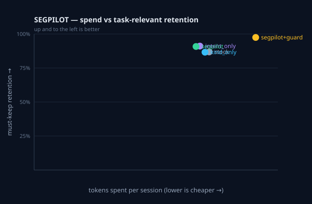

# SEGPILOT replay report

Offline replay of **11 recorded session(s)** under 5 compression arms. Compression ran on Paritok's hosted GPU; every arm was applied to identical, uncompressed reference content.

> **Verdict (see [results.md](../../docs/results.md)):** intent/kind routing does not reliably beat stock. `kind_only` equals `stock` everywhere; the only mover is must-keep retention under intent, and it is small (+~9pp mean) and inconsistent (it reverses on one of three drift sessions). `task ret.` is essentially constant across arms, so `rel/1k` is flat and reflects only how hard each arm compressed. Read must-keep retention as the discriminating axis, not rel/1k.

## Aggregate — campaign (7 session(s))

| arm | ratio | saved | must-keep ret. | task ret. | rel/1k | Δ vs stock | guard trips |
|---|--:|--:|--:|--:|--:|--:|--:|
| `stock` | 0.504 | 50% | 86% | 98% | 0.04 |  | 0 |
| `kind_only` | 0.494 | 51% | 86% | 98% | 0.04 | 1.02× | 0 |
| `intent_only` | 0.494 | 51% | 94% | 98% | 0.04 | 1.02× | 0 |
| `segpilot` | 0.483 | 52% | 94% | 98% | 0.04 | 1.04× | 0 |
| `segpilot+guard` | 0.592 | 41% | 97% | 98% | 0.03 | 0.85× | 5 |

## Aggregate — single-bug (4 session(s))

| arm | ratio | saved | must-keep ret. | task ret. | rel/1k | Δ vs stock | guard trips |
|---|--:|--:|--:|--:|--:|--:|--:|
| `stock` | 0.552 | 45% | 91% | 89% | 0.21 |  | 0 |
| `kind_only` | 0.563 | 44% | 94% | 89% | 0.20 | 0.98× | 0 |
| `intent_only` | 0.549 | 45% | 91% | 89% | 0.21 | 1.01× | 0 |
| `segpilot` | 0.527 | 47% | 89% | 89% | 0.22 | 1.05× | 0 |
| `segpilot+guard` | 0.761 | 24% | 100% | 94% | 0.16 | 0.77× | 2 |

## Aggregate — all sessions

| arm | ratio | saved | must-keep ret. | task ret. | rel/1k | Δ vs stock | guard trips |
|---|--:|--:|--:|--:|--:|--:|--:|
| `stock` | 0.511 | 49% | 87% | 96% | 0.03 |  | 0 |
| `kind_only` | 0.504 | 50% | 87% | 96% | 0.03 | 1.01× | 0 |
| `intent_only` | 0.502 | 50% | 94% | 96% | 0.03 | 1.02× | 0 |
| `segpilot` | 0.489 | 51% | 93% | 96% | 0.03 | 1.05× | 0 |
| `segpilot+guard` | 0.615 | 39% | 97% | 98% | 0.03 | 0.84× | 7 |

> **must-keep ret.** = fraction of Paritok's own must-keep spans (paths, identifiers, error classes) surviving compression — the axis on which the arms actually differ. **rel/1k** = task-relevant tokens retained per 1000 spent; it is flat here because task retention is constant across arms, so it measures only compression aggressiveness. Campaign sessions are the drift test; single-bug sessions are the no-drift control.

## Per task

| task | arm | ratio | task ret. | rel/1k |
|---|---|--:|--:|--:|
| bug_01 | `stock` | 0.460 | 60% | 0.50 |
| bug_01 | `kind_only` | 0.493 | 60% | 0.47 |
| bug_01 | `intent_only` | 0.460 | 60% | 0.50 |
| bug_01 | `segpilot` | 0.460 | 60% | 0.50 |
| bug_01 | `segpilot+guard` | 0.791 | 80% | 0.39 |
| bug_02 | `stock` | 0.599 | 100% | 1.03 |
| bug_02 | `kind_only` | 0.599 | 100% | 1.03 |
| bug_02 | `intent_only` | 0.599 | 100% | 1.03 |
| bug_02 | `segpilot` | 0.599 | 100% | 1.03 |
| bug_02 | `segpilot+guard` | 0.599 | 100% | 1.03 |
| bug_03 | `stock` | 0.547 | 100% | 1.31 |
| bug_03 | `kind_only` | 0.547 | 100% | 1.31 |
| bug_03 | `intent_only` | 0.529 | 100% | 1.36 |
| bug_03 | `segpilot` | 0.529 | 100% | 1.36 |
| bug_03 | `segpilot+guard` | 0.529 | 100% | 1.36 |
| bug_04 | `stock` | 0.631 | 100% | 0.74 |
| bug_04 | `kind_only` | 0.631 | 100% | 0.74 |
| bug_04 | `intent_only` | 0.631 | 100% | 0.74 |
| bug_04 | `segpilot` | 0.552 | 100% | 0.84 |
| bug_04 | `segpilot+guard` | 1.000 | 100% | 0.47 |
| campaign_1 | `stock` | 0.399 | 100% | 0.25 |
| campaign_1 | `kind_only` | 0.405 | 100% | 0.24 |
| campaign_1 | `intent_only` | 0.425 | 100% | 0.23 |
| campaign_1 | `segpilot` | 0.368 | 100% | 0.27 |
| campaign_1 | `segpilot+guard` | 0.471 | 100% | 0.21 |
| campaign_2 | `stock` | 0.548 | 100% | 0.28 |
| campaign_2 | `kind_only` | 0.548 | 100% | 0.28 |
| campaign_2 | `intent_only` | 0.405 | 100% | 0.38 |
| campaign_2 | `segpilot` | 0.405 | 100% | 0.38 |
| campaign_2 | `segpilot+guard` | 0.760 | 100% | 0.20 |
| campaign_3 | `stock` | 0.496 | 86% | 0.20 |
| campaign_3 | `kind_only` | 0.445 | 86% | 0.23 |
| campaign_3 | `intent_only` | 0.552 | 86% | 0.18 |
| campaign_3 | `segpilot` | 0.551 | 86% | 0.18 |
| campaign_3 | `segpilot+guard` | 0.661 | 86% | 0.15 |
| campaign_4 | `stock` | 0.625 | 100% | 0.24 |
| campaign_4 | `kind_only` | 0.604 | 100% | 0.25 |
| campaign_4 | `intent_only` | 0.562 | 100% | 0.27 |
| campaign_4 | `segpilot` | 0.562 | 100% | 0.27 |
| campaign_4 | `segpilot+guard` | 0.562 | 100% | 0.27 |
| campaign_5 | `stock` | 0.488 | 100% | 0.33 |
| campaign_5 | `kind_only` | 0.485 | 100% | 0.33 |
| campaign_5 | `intent_only` | 0.519 | 100% | 0.31 |
| campaign_5 | `segpilot` | 0.520 | 100% | 0.31 |
| campaign_5 | `segpilot+guard` | 0.520 | 100% | 0.31 |
| campaign_6 | `stock` | 0.514 | 100% | 0.26 |
| campaign_6 | `kind_only` | 0.514 | 100% | 0.26 |
| campaign_6 | `intent_only` | 0.486 | 100% | 0.28 |
| campaign_6 | `segpilot` | 0.485 | 100% | 0.28 |
| campaign_6 | `segpilot+guard` | 0.655 | 100% | 0.21 |
| campaign_7 | `stock` | 0.521 | 100% | 0.37 |
| campaign_7 | `kind_only` | 0.526 | 100% | 0.37 |
| campaign_7 | `intent_only` | 0.545 | 100% | 0.35 |
| campaign_7 | `segpilot` | 0.545 | 100% | 0.35 |
| campaign_7 | `segpilot+guard` | 0.545 | 100% | 0.35 |

